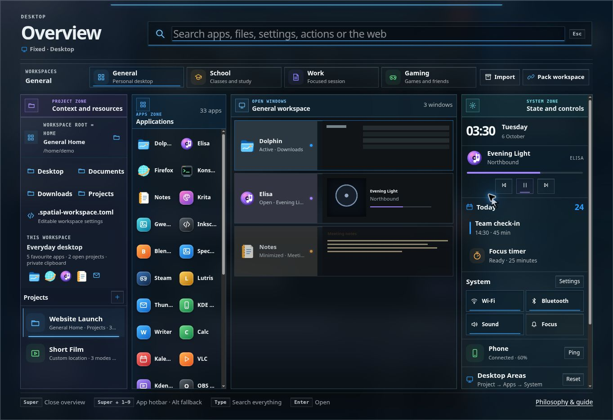

# Spatial Desktop

**A tactile, project-centred computing environment.**

**Work in progress (WIP).** The design, interactions and documentation are still evolving. This is an experimental browser prototype with simulated apps and integrations.

Spatial Desktop is an interactive browser prototype of a desktop organised around workspaces, projects and docked Areas. It explores how windows, useful app widgets and system tools can share the screen without a conventional taskbar.

[Live demo](https://xefensor.github.io/spatial-desktop/) · [Design philosophy](https://xefensor.github.io/spatial-desktop/philosophy.html)



## Run locally

No build step or npm dependencies are required. From the repository root:

```sh
python3 -m http.server 8000 --directory dist
```

Open **http://localhost:8000**, then use the browser's fullscreen command. In JetBrains IDEA, open this folder as a project and run the same command in its terminal.

Serve the files over HTTP rather than opening `index.html` directly. Browser storage saves demo state for each origin. To test an older version without reusing the current version's state, serve it on a different port or use a separate browser profile.

## Publish on GitHub Pages

The workflow in [`.github/workflows/pages.yml`](.github/workflows/pages.yml) checks the JavaScript and runs the existing layout/interaction checks, then publishes only `dist/`. It runs on pushes to `main` and can also be started manually.

### One-time setup

1. Open [Settings → Pages](https://github.com/xefensor/spatial-desktop/settings/pages).
2. Under **Build and deployment**, set **Source** to **GitHub Actions**.
3. Open [the publishing workflow](https://github.com/xefensor/spatial-desktop/actions/workflows/pages.yml) and choose **Run workflow** on `main`, or rerun the failed deployment after enabling Pages.

Once deployment succeeds, the default site address is **https://xefensor.github.io/spatial-desktop/**. The workflow's deployment environment also shows the actual published URL.

The workflow uses GitHub's built-in token; no custom deployment secret or personal access token is needed after the one-time Pages setup. Deployment fails with `Get Pages site failed / Not Found` when Pages are not enabled or available for the repository.

GitHub documentation: [custom Pages workflows](https://docs.github.com/en/pages/getting-started-with-github-pages/using-custom-workflows-with-github-pages).

## Explore the desktop

- **Apps Area:** launch apps, use the numbered app hotbar and control parked windows through live cards.
- **Project Area:** organise a project folder, linked resources, notes, quick launches and saved window arrangements. Projects can have multiple modes for different kinds of work.
- **System Area:** keep relevant system widgets and notifications visible.
- **Overview:** access workspaces, projects, apps and system tools together. The Super/Windows key works when the browser receives it; the operating system may intercept it.
- **Windows:** ordinary dragging uses the tiled layout. Middle-button dragging or Alt + left-button dragging enables manual floating movement. New tiled windows try to avoid floating windows.
- **Areas:** resize and reposition docked Areas using their handles. Actual app fullscreen can temporarily move Areas to a second display when space permits.
- **Two displays:** open the same local URL in two browser windows and use the prototype's display assignment controls. Synchronisation requires the same browser profile and origin; it is a simulation rather than access to native monitor/window management.

## Demonstration examples

The public demo starts with four distinct, resumable scenes:

| Workspace | Activity | Initial layout |
| --- | --- | --- |
| General | Everyday files, no open Project | One Dolphin window, Apps on a left rail, System right |
| School | Urban Ecology research, reading with project notes and linked sources | Project left, reading window centre, System right, Apps on a bottom rail |
| Work | Website Launch in Build mode | Preview above development terminal, Project right, Apps on a left rail, System on a bottom rail |
| Gaming | Co-op session, no open Project | Games and friends in Web, music in a live Apps card on the left, System on a right rail |

The library also contains **Short Film** (Editing, Review, Delivery), kept on another drive to demonstrate that a Project can live in any folder. Urban Ecology has one mode, so it does not show a mode switcher. Website Launch has Design, Build and Review modes. Files, resources, notifications, music and browser pages are illustrative data.

This scene update refreshes the built-in workspace arrangements once and retains a backup of their previous session data. Workspaces attached to custom Projects are left alone; edited Project definitions and existing workspace notes are preserved. Later visits and workspace switches restore the user's changes rather than reset the examples. Historical commits retain their original examples.

## Material philosophy

Windows primarily use opaque ABS plastic surfaces, with short mechanical press feedback. Secondary surfaces use transparent glass/acrylic. Their lighting communicates state instead of adding decoration everywhere.

- Main window content is always opaque.
- Areas and their content use square geometry; app windows and controls can use softer corners.
- Toggle controls have a persistent indicator line; momentary buttons do not.
- App colours connect each window with its launcher and live card.
- Important content stays readable, with small borders and efficient spacing.

The detailed reasoning, experiments and workflow models are in [`dist/philosophy.html`](dist/philosophy.html). When the server above is running, open **http://localhost:8000/philosophy.html**.

## Files

| Path | Purpose |
| --- | --- |
| `dist/index.html` | Current fullscreen desktop |
| `dist/desktop-shell.js` / `.css` | Desktop behaviour and appearance |
| `dist/spatial-tiling.js` | Tiling and floating-window obstacle layout |
| `dist/demo-examples.js` | Generic project examples and saved-data migration |
| `dist/spatial-intent.js` | Area allocation and fullscreen intent policy |
| `dist/philosophy.*` | Design and workflow documentation |
| `dist/material-guide.html` / `material-lab.html` | Material examples and earlier explorations |
| `scripts/` | Layout and interaction checks |
| `docs/history/` | Version map and exact original Git history |
| `.openai/hosting.json` | Existing Sites hosting metadata; not needed for local use |

## Checks

With Node.js installed:

```sh
node scripts/check-spatial-intent.cjs
node scripts/check-spatial-tiling.cjs
node scripts/check-demo-examples.cjs
```

## Development history

All **153 saved source versions**, from the original Material Interface Lab to the current Spatial Desktop, are imported as chronological commits. Each imported commit's source tree matches its original tree byte for byte.

The connected GitHub interface recreates commit identities and dates, so the imported commits have new SHAs. Original SHAs, author/committer timestamps and the mapping to imported commits are recorded in [`docs/history/versions.json`](docs/history/versions.json). An included Git bundle preserves the **unaltered original commits** as well.

See [`docs/history/README.md`](docs/history/README.md) for checking out versions or restoring the original history.

## Work in progress & prototype scope

Spatial Desktop is still under active development. This is a design demonstration, not a native desktop environment. Its apps, files, system widgets and project/workspace packaging illustrate interactions; they do not provide complete operating-system integrations. Demo data is stored in the browser.

See the [UI and UX refinement notes](docs/ui-ux-review.md) for the latest overview and accessibility changes.
