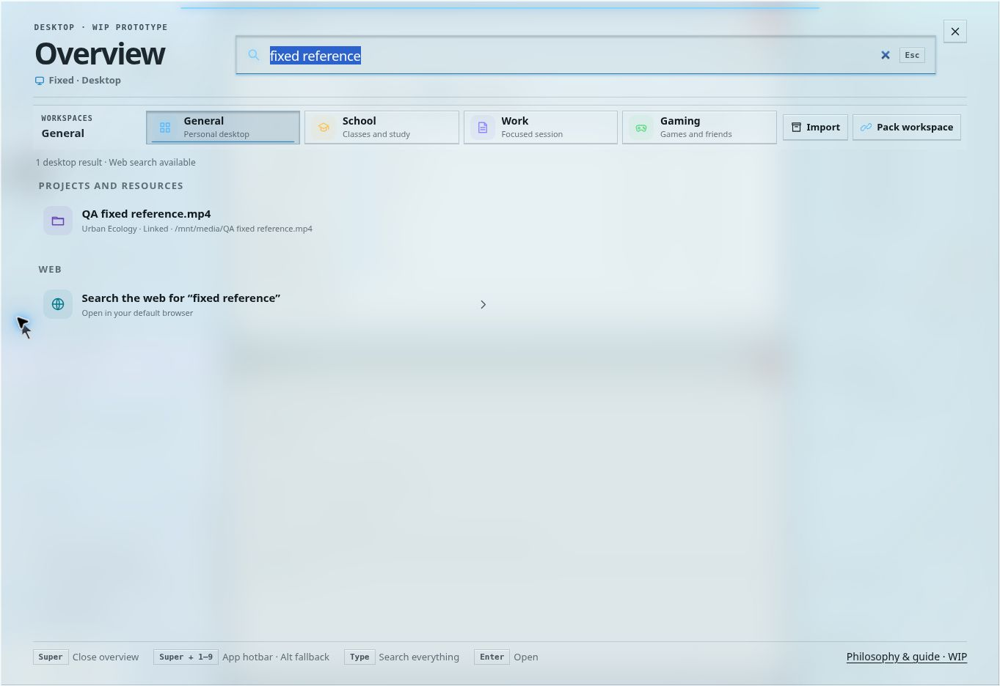

# Spatial Desktop: broad workflow test pass

Date: 7 October 2026. Baseline: `93e8f6d45223e2a6e7442317cf7bee71b3ba89d3`.

This pass tested the browser prototype as a desktop: starting work, switching contexts, rearranging windows, finding things, recovering from interruptions and continuing on another display. It is a substantial regression pass, not proof that every possible desktop workflow works. Spatial Desktop remains a work in progress.

## Environment and methods

- Interactive Chrome browser, 1363 × 936 viewport, live GitHub Pages site.
- A second tab on the same origin/profile simulated another display. Tests covered shared state and display allocation, not physical monitor discovery.
- DOM observations and screenshots checked settled geometry. An intermediate animation frame is not a final layout failure.
- Production-function tests and the existing layout/session suites covered conditions that cannot be generated reliably through this browser's UI.
- The new deterministic layout stress test uses seed `0x5a17`, 150 mixed steps at each of eight available-workspace sizes: 320 × 480, 640 × 700, 900 × 720, 1280 × 800, 1920 × 1080, 3440 × 1440, 5120 × 1440 and 1800 × 450. These are layout-engine bounds, not eight browser viewport screenshots.

## Confirmed failures and fixes

| Failure or source-level gap | Change | Regression evidence |
| --- | --- | --- |
| Searching `urban` or `website launch` did not find the corresponding project | Search now includes current projects, folders, modes, linked resources and project quick notes; results open their project | Production-function search and escaping tests; live recheck below |
| `/mnt/media/QA reference.mp4` became a website with hostname `mnt` | Resource classification distinguishes local/relative/Windows paths from HTTP(S) URLs and keeps the original location | 19 path/address cases, including spaces and Unicode |
| Main Terminal advertised `echo hello` but reported command not found; live card used a different command path | Both use the same simulated command handler; `pwd` follows the current project/workspace | Shared-handler, literal output, command and context tests |
| Overview Wi-Fi and System Area Wi-Fi could show opposite states | Matching controls share their state and accessible pressed value, persist it and apply remote state consistently | Duplicate-control and blocked-storage tests |
| Keyboard app mutations relied on a later pointer/click event to publish to the other display | Open, minimize, close and hotbar activation explicitly queue a state broadcast | Mutation coverage; live keyboard/display recheck below |
| Escape could exit fullscreen while a context menu or modal was being dismissed | Transient surfaces get Escape first | Fullscreen plus each modal/menu regression |
| Keyup used implicit browser globals for dialog element IDs | Dialog elements are explicitly resolved | Keyboard tests without browser named globals |
| Quick-setting buttons lost their accessible names on the System rail | Explicit names remain present when the visible label is hidden | Seven-control markup regression |
| Project rail note/resource actions focused hidden fields | Explicit editor actions expand their dock lane, then focus and scroll the field into view | Four-edge rail-editor regression; live recheck below |

The first four, the rail-editor issue and the missing rail names were reproduced interactively. The keyboard broadcasting, Escape priority and implicit-global gaps were found by inspecting the event paths and added to regression coverage; they should not be presented as independently reproduced browser failures.

## Interactive workflow matrix

“Pass” means the listed interaction and observable result were checked, not that the real app/integration is implemented.

| Use case | What was exercised | Result |
| --- | --- | --- |
| Start a normal session | General starts with Dolphin, no Project, Apps rail and System Area | Pass |
| Multitask | Launch Elisa, Konsole and Notes; four settled tiles fit without overlap | Pass |
| Park and resume | Minimize/restore Notes; Unicode text survives parking and reload | Pass |
| Numbered hotbar | Alt+5 browser fallback focuses/parks Notes | Pass |
| Browse app library | All 13 categories, including Favorites and Lost & Found | Pass |
| Keyboard search | Find Dolphin, ArrowDown into results, Enter to launch; Escape closes Overview | Pass |
| Search files and actions | `landscape.jpg`, `focus`, no-match query with web fallback | Pass |
| Find a project | Search by project name | Failed initially; fixed |
| Switch work contexts | General → School → Work → General; isolated layouts, notes and active projects | Pass |
| Switch project modes | Website Launch Design/Review/Build restore different app arrangements; project note stays shared | Pass |
| Close and reopen project | Save project windows, reopen from Overview, restore the saved mode | Pass |
| Create custom project | Empty-name validation; Unicode/punctuation name; custom folder; removal confirmation | Pass |
| Manage modes | Add/select/delete a mode; hide navigation with one mode; prevent deleting last mode | Pass |
| Link outside resource | Absolute file path containing spaces | Failed initially; fixed |
| Workspace packaging | Open Pack, choose template option, cancel; open/cancel Import preview | Pass for preview interaction only |
| Maximize between Areas | Expand app between Areas, park peers, restore peers | Pass |
| Exclusive fullscreen | Fill single display, hide Areas temporarily, Escape restores desktop | Pass |
| Overlay over fullscreen | Alt+Space opens Overview above app fullscreen | Pass |
| Context actions | Right-click title, float window at sensible size, tile around it, return to tiling | Pass |
| Keyboard context menu | Shift+F10 on hotbar, End selects final command, Escape dismisses | Pass |
| Rearrange tiles | Normal left title drag changes arrangement; Areas remain fixed | Pass |
| Reposition Areas | Move Apps left → right → top; horizontal layout; resize to rail | Pass |
| Extend desktop | Second tab contains assigned windows rather than copies | Pass |
| Transfer app | Move Konsole to display 2 and back; source hides it, destination shows it | Pass |
| Fullscreen with spare display | Three Areas occupy three columns on empty display 2 | Pass |
| Fullscreen with occupied display | Secondary Konsole retiled between Areas; settled bounds fit without overlap | Pass |
| Disconnect display | Close second tab and recover usable single-display layout | Pass |
| Themes and reload | Auto/Light/Graphite/OLED selection; manual Light survives reload | Pass |
| Music controls | Pause from Overview updates Elisa's control state | Pass |
| Timer | Start 25-minute focus, countdown advances, pause changes state | Pass |
| Notifications | Phone ping creates inline notification; dismiss removes it; four new notifications enlarge stack | Pass |
| Long System content | Scroll overflowing stack; scroll position advances while header remains fixed | Pass |
| Project rail editor access | Click Add resource on a rail; reveal content before focus | Failed initially; fixed |
| Quick settings consistency | Overview and System Wi-Fi state | Failed initially; fixed |

## Automated checks

Run from the repository root:

```sh
node scripts/check-spatial-intent.cjs
node scripts/check-spatial-tiling.cjs
node scripts/check-demo-examples.cjs
node scripts/check-ui-refinements.cjs
node scripts/check-desktop-workflows.cjs
```

All five suites passed after the code changes. All `dist/*.js` files passed `node --check`, and `git diff --check` passed. A local-reference scan checked 57 HTML asset/navigation references with no missing targets. The new workflow suite is included in GitHub Pages verification.

Existing suites additionally exercise pointer capture loss, cancellation, blur/missing-release recovery, middle/Alt detach sizes, floating-window avoidance, hidden-window parking, fixed Area invariants, workspace/mode persistence, migration, malformed/custom demo data, modal focus return, material inheritance, automatic theme changes and storage restrictions.

The 1,200 mixed layout steps check finite positive geometry, screen bounds, minimum usability when there is sufficient room, no tile overlap, floating-window clearance, unique leaves and persistence round trips. If a floating window leaves no usable room, parking is expected. A single app in an undersized viewport may be smaller than its normal minimum; these tests do not claim that tiny screens remain fully usable.

## Deployment recheck

GitHub Pages verification and deployment succeeded for `3b7b644` and the rail-editor follow-up `2ef47a7`. On the deployed site:

| Recheck | Observed result |
| --- | --- |
| Search `urban`, navigate with ArrowDown/Enter | Urban Ecology is found and activated |
| Add `/mnt/media/QA fixed reference.mp4` | Correct basename and `Linked · /mnt/media/QA fixed reference.mp4`; not a website |
| Search `fixed reference` | Linked resource is found with its owning project |
| Search `school qa`, select the project quick note | Note becomes visible and receives focus after the layout frame |
| Add-resource command from Project rail | Project expands; the actual input becomes visible and focused |
| Terminal `echo QA fixed — <b>literal</b>` and `pwd` | Literal text output and the active project folder |
| Change Wi-Fi in Overview, reload | Both controls remain off; remote change turns both on |
| Alt+5 open/park, Enter on Close Notes | Secondary Overview updates after the state broadcast; no duplicate window |
| Escape with a context menu over fullscreen | First Escape closes the menu and keeps fullscreen; second exits fullscreen |
| Browser logs | No site-origin warning/error entries observed in the final recheck; unrelated extension errors were excluded |
| Guide pages | Philosophy → Materials navigation, light theme, both material toggles and keyboard slider adjustment work |



The later rail-name markup adjustment is covered by the automated control-name check. Hardware and accessibility limits below still apply.

## Limits and follow-up priorities

- Browser-reserved Super/Windows shortcuts, physical multi-monitor edges, monitor refresh rate, actual Firefox/Safari behavior and native Wayland/X11 interactions remain unverified. Alt shortcuts were used where the browser or OS intercepts Super.
- Real middle/Alt pointer dragging was covered by production adapter tests; ordinary left dragging and the Float context action were checked interactively. This browser's drag API cannot hold middle/modifier input through a drag.
- A transient fullscreen/state reversion appeared once while both display tabs were being manipulated. Clean sequential repeat tests passed. Simultaneous cross-display edits remain a concurrency stress-test priority; this pass does not claim a transactional sync protocol.
- The prototype does not provide native file access, real application processes, genuine network/Bluetooth settings or complete workspace/package import/export. Their demonstration controls must not be confused with OS functionality.
- Project quick notes and resources are searchable after this fix. Personal Notes drafts and arbitrary real file contents are not a general full-text index.
- No screen-reader session, formal contrast audit, touch/pen hardware test, 200% browser-zoom matrix, long-duration timer expiry/suspend test or security audit was performed.
- Stress-test bounds validate the tiling engine, not typography/readability at each corresponding viewport. Narrow laptop layouts, fractional scaling, touch hit areas and very large project/resource lists deserve a dedicated visual/accessibility pass.
