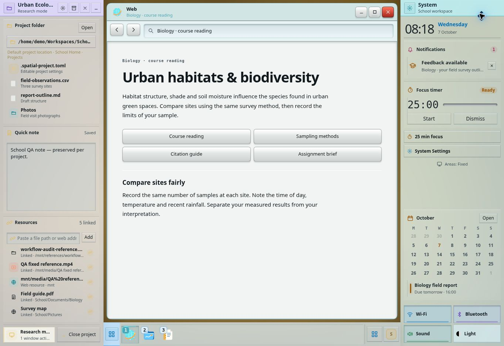

# Spatial Desktop: cross-platform workflow audit

**Research and assessment: 7 October 2026. Prototype: WIP.** Baseline [`6af1281`](https://github.com/xefensor/spatial-desktop/commit/6af12813a42a4891d821cb256020deec88708e8c). This report evaluates the design and that version of the prototype; it does not claim the following recommendations are implemented.

## What the audit says

Spatial Desktop is most promising when the work has a lasting identity: a course, a film, a software project, a recurring work context. Keeping resources, notes, useful parked-app controls and window arrangements together could reduce the cost of returning to that work. The demo already demonstrates much of that organisation.

Its hardest problems are more ordinary: two documents in the same application, temporary tasks that do not deserve a Project, tools shared across contexts, tight displays, precise keyboard positioning, and safe recovery. These determine whether the model can replace a daily desktop rather than merely make a convincing demonstration.

**The biggest immediate structural gap is window identity.** The prototype has five app frames, one per app. A real desktop has applications, processes, windows, documents, background jobs and sometimes several views of the same service. Several everyday workflows cannot be represented faithfully until those are separate objects. Another important gap is that many catalog entries and file commands only show a toast. That limits the current demo; it does not, by itself, invalidate the desktop model.

**No claim of universal superiority is justified yet.** “Likely favourable” below is a design prediction about a named task, not a result from a comparative user study. Workspaces and Modes must earn their added concepts by helping users resume work, without making casual use harder.

## Scope and method

This is a broad, explicit catalog of **100 scenarios in ten families**, not a claim to enumerate every possible use of every OS. Sources cover Windows, PowerToys, macOS, KDE Plasma/Dolphin, GNOME, i3, ChromeOS, Android/Pixel, iPadOS and Haiku, plus application workflows and accessibility guidance. Vendor documentation establishes capabilities; first-person community reports establish examples of real needs, not their prevalence.

Research was organised around intents: launch, find, compare, create, communicate, organise, interrupt/resume, move between devices, protect and recover. The matrix includes casual use, study, office work, programming, creative production, media, gaming, accessibility and system administration. Specialist fields such as GIS, CAD, lab instruments and financial terminals would need additional domain tests; their general multi-window, device, data and recovery requirements are represented here, not their complete specialised workflows.

Evidence comes from three different methods:

1. Primary OS/application documentation and a small sample of first-person workflow reports, listed under Sources. A documented feature is not automatically a usability success.
2. The [earlier broad test pass](testing-2026-10-07.md), reused as **prior evidence**, plus eleven focused interactive checks during this audit. Chrome viewport was 1363 × 936. No alternate OS was installed or operated in this pass.
3. Source inspection and a fresh run of all five existing check suites. The layout stress suite includes 1,200 seeded operations at eight engine bounds; those are not eight browser/hardware measurements.

### Read the matrix correctly

| Prototype status | Meaning |
| --- | --- |
| Works | The relevant demo interaction/mechanism was observed or covered by existing tests. Real application/OS functionality is not implied. |
| Partial | A useful part is demonstrated, but the end-to-end scenario is incomplete or unverified. |
| Gap | A required design/implementation capability is absent, or a specific failure was observed. |
| Native | Completing the scenario requires filesystem, application, device, account or system services not provided by this browser prototype. There may also be a design requirement. |

Evidence codes link to the evidence register below. **N** is a new interactive check; **P** is the previous pass; **A** is automated checks; **C** is source inspection. Source codes identify the researched comparison, not proof the demo completes that task. The CSV contains the same 100 rows for filtering; the Markdown groups them by family. There is no aggregate score: printing, research and accessibility are not interchangeable items to average.

## How familiar workflows translate

| Existing habit | Spatial translation | Where it fits | Where it can be worse |
| --- | --- | --- | --- |
| Taskbar/dock and minimise | Numbered hotbar plus parked live cards | App recall, media controls, quick notes | Too many cards; app number ambiguous with several windows |
| Save a group of windows | Project Mode and its window session | Recurring research/build/review arrangements | Geometry alone cannot restore documents, URLs or processes |
| Virtual desktops for short tasks | Mode or temporary arrangement within the same context | One Project with several phases | Creating a new Workspace Home for every old desktop is excessive |
| Separate work/personal contexts | Workspace with Home, Areas, favourites and app configuration | Long-lived contexts | Folder/layout separation does not isolate accounts or cookies |
| i3 scratchpad / global utilities | Parked live card or explicitly global service window | Music, chat, calculator, quick capture | A Workspace-local singleton may hide the only instance at the wrong time |
| Tags and collections | Project resource references with provenance | Sources reused without copying | Broken paths, confusing unlink/delete, unavailable external files |
| Snap/custom zones | Fixed docked Areas plus bounded split tree | Several usable tools around visible context | Automatic parking can remove the reference the user needs |
| Fullscreen application | Borrow Area space, park peers, relocate Areas if safe | Games, media, focused editing | Relocating onto an audience monitor could expose private content |
| Phone/tablet app pairs and PiP | Remembered tool pairing and lightweight live controls | Reading plus video or notes | Desktop mouse gestures do not translate directly to touch |

Relevant precedents are already real: PowerToys Workspaces saves launches/placements [S03]; ChromeOS supports saved desks and windows on all desks [S04]; i3 exposes scratchpad windows [S07]; Haiku Replicants embed useful app parts [S27]. These resemble individual mechanisms. Spatial Desktop's proposed distinction is their combination around folders, Projects, Modes and consistent Areas—not the invention of every mechanism.

### What real users' examples add

A KDE contributor describes context-specific favourites, browser profiles, shared communication/music and a sparse presentation context [S05]. This argues for both local context and deliberately global tools. KDE community discussions distinguish one combined multi-monitor work surface from a fixed reference screen alongside changing work [S30, S32]. They should be separate supported choices, not an assumption that every spare screen is interchangeable.

A first-person i3 discussion asks for visible access to hidden chat/music windows [S33], matching the value of live cards. An Apple community post reports friction grouping multiple Safari windows and dragging between them [S34], reinforcing the importance of multiple window instances and cross-window operations. These are illustrative reports, sometimes about older versions; they are not evidence that all users or current OS releases have those problems.

## New interactive evidence

The capture shows the test browser's School arrangement and disposable QA note/resource data. It is evidence of the simulated arrangement, not native application integration.

| ID | Procedure | Observed result | Interpretation |
| --- | --- | --- | --- |
| N01 | Open Dolphin alongside Terminal; activate Dolphin launcher again; inspect app frames. | One Dolphin frame remains; repeat launch focuses it. Five frame identities exist in the DOM. | Singleton model; there is no second independent file-manager instance. Hotbar behaviour and ordinary launcher behaviour are different commands. |
| N02 | Open Overview and launch Blender. | Overview closes; no Blender frame is created and existing frames remain the same. | Specialist catalog launches are demonstrations, not implemented applications. Source confirms toast-only path. |
| N03 | Search the unique Unicode phrase already stored in personal Notes: `žluťoučký`. | No local result; web fallback is shown. | Personal Notes contents are outside the current local index. |
| N04 | Search `school qa`, a saved Project quick-note phrase. | `Urban Ecology · Quick note` appears. | Project quick-note search works; this is a different index scope from personal Notes. |
| N05 | Focus `Resize System area` in School, press ArrowLeft, read settled width. | Width stays 280 px; handle is keyboard focusable. | This Area handle has no directional keyboard resize operation. Edge cycling/reset context commands and tiled split dividers do exist, so this is not a claim that every layout command is drag-only. |
| N06 | Add `/mnt/references/workflow-audit-reference.pdf` to Urban Ecology. | Correct basename, `Linked` classification and original path appear; resource count increases. | Outside-root references can be represented, but file existence and access are not checked. |
| N07 | Right-click that disposable test resource → Remove link; reload; inspect again. | Row disappears, then returns after reload with the saved resource count. | Reproduced persistence bug: unlink mutates DOM without updating the Project resource model. |
| N08 | Put an audit marker in the test browser clipboard, then choose Copy reference. | UI says reference copied; clipboard still contains the marker. | Copy reference is currently a toast, not a clipboard operation. No pre-existing clipboard content was read. |
| N09 | Switch School → Work through Overview. | Website Launch/Build returns with its separate note, top Apps rail, bottom System rail and right Project Area. | Workspace context and Area arrangement restore independently. |
| N10 | Pause music in Work's Overview, switch to General. | General Overview shows Play; the global media state remains paused. | A useful global service already exists in the demo, even with Workspace-local app arrangements. |
| N11 | Inspect General personal Notes after returning from Work. | Original Unicode note remains unchanged. | Personal Notes draft remains Workspace scoped across this switch. |

Two input/evaluation calls hit browser protocol timeouts. A fresh observation showed the actions had completed; the reload and copy outcomes above were then inspected in settled state. These infrastructure timeouts are not counted as product bugs. The disposable reference is test browser data, not a repository example or a real disk file.

### Reused evidence register

| Code | Evidence |
| --- | --- |
| P01 | Earlier test: General starts with one Dolphin window and no active Project. |
| P02 | Earlier test: four app tiles fit; open, park and restore interactions. |
| P03 | Earlier test: personal Notes text survives park/restore and browser reload. |
| P04 | Earlier test: numbered hotbar fallback, thirteen categories, Overview keyboard search, Project/file/action results. |
| P05 | Earlier test: General/School/Work context isolation and distinct examples. |
| P06 | Earlier test: custom Project paths, Modes, close/reopen, resource classification and rail editor access. |
| P07 | Earlier test: Pack/Import preview, modal focus return, keyboard context menus; not actual package transfer. |
| P08 | Earlier test: bounded maximise/fullscreen, peer parking, Overview and Escape priority. |
| P09 | Earlier test: left title drag, Float context action, fixed Areas, edge moves and rail resize. |
| P10 | Earlier test: two same-origin tabs, window transfer, spare/busy second-display allocation and disconnect recovery. One transient concurrent reversal remains unresolved. |
| P11 | Earlier test: shared simulated terminal commands, music controls, timer start/count/pause. |
| P12 | Earlier test: inline notification creation/dismissal and overflowing System Area scroll. |
| P13 | Earlier test: Auto/Light/Graphite/OLED, manual theme reload and control consistency. |
| A01 | All five check suites rerun successfully during this audit; includes layout, adapter, persistence, modal, material, input cancellation and 1,200-step stress checks. |
| C01 | `dist/index.html` and launcher paths: five singleton app frames; extra catalog apps primarily launch toast demonstrations. |
| C02 | File/context/terminal/device/package handlers: simulated operations; no general native OS/application bridge or full-text index. |
| C03 | Workspace/Project/Mode session structures and resource storage: Project definition shared, active Project/Mode Workspace scoped, one active Project; unlink is DOM-only. |
| C04 | Area/window pointer handlers, keyboard/context controls and accessibility CSS: partial alternatives, no full manual positioning/Area resize keyboard mode; no hardware/screen-reader certification. |
| C05 | Notification inline/peek policy and attention styling: different expanded/rail/hidden treatment, without native notification priorities/privacy pipeline. |

## The 100-scenario matrix

“Alternative/comparison” is the audit's reasoning. A predicted benefit assumes the named missing native services and design choices are implemented. A negative demo result is not silently converted into a positive product claim.

### Everyday use

| ID / scenario | Today | Translation | Alternative / better or worse | Evidence · sources |
| --- | --- | --- | --- | --- |
| **W001** Open an app without organising anything | Works | General, no Project, launcher or Overview; window joins available tiles. | Keep this zero-setup route. Neutral for one app; potentially more overhead than a plain taskbar. | P01, P04, N01 · S01, S02 |
| **W002** Switch rapidly among favourite apps | Works | Numbered hotbar focuses or parks its single demo window. | Stable slots and visible numbers are promising; benchmark against taskbar shortcuts before calling it faster. | P04 · S01 |
| **W003** Temporarily consult a calculator or dictionary | Partial | Open a small window then park it; catalog Calculator is a launch toast. | An ephemeral window should leave no Project or Mode behind. Current demo is worse than a real calculator. | N02, C01 · S08 |
| **W004** Keep music playing while doing other work | Works | Overview media controls share player state across Workspaces. | Good fit for a global service; a local player window need not appear everywhere. Real playback remains simulated. | N10, P05 · S05, S18 |
| **W005** Answer a message and immediately return | Native | Use a notification action or a small temporary chat window. | Inline replies would reduce disruption. Native notification/app actions are required; current demo cannot do this. | C02 · S18, S20 |
| **W006** Switch an entire work context | Works | Workspace restores its Areas, active Project and windows. | Likely favourable for recurring school/work contexts; a full Workspace is excessive for every short interruption. | P05, N09 · S03, S04, S05 |
| **W007** Find a known application by typing | Works | Super/Overview, type, choose result; browser uses fallback shortcuts. | Comparable to existing launchers. Discoverability comes from combining results rather than inventing another shortcut. | P04 · S08 |
| **W008** Find an unfamiliar app by category | Works | Overview offers thirteen categories and recognisable app icons. | Useful for exploration; keyboard search usually needs fewer steps once the name is known. | P04, C01 · S08 |
| **W009** Recover a parked window quickly | Works | Live card and its matching hotbar number restore the window. | Potentially better than icon-only minimisation; many rich cards can make scanning slower. Offer a dense list as well. | P03, P04 · S07, S27 |
| **W010** Open an app already running | Partial | Launcher focuses its existing frame; hotbar can park it. | Separate Focus from New window. Current singleton model is worse whenever the user needs another document instance. | N01, C01 · S06, S14 |

### Files and resources

| ID / scenario | Today | Translation | Alternative / better or worse | Evidence · sources |
| --- | --- | --- | --- | --- |
| **W011** Copy between two folders | Native | Dolphin shape is present, but no real copy and no second instance. | Keep native split view or two file windows. Project resources supplement file management; they cannot replace it. | N01, C02 · S09 |
| **W012** Drag a file into another app | Native | No real file payload or receiving application exists. | Preserve normal OS drag-and-drop and a keyboard file-picker route; Areas must not intercept a file drag as a window drag. | C02 · S09, S10 |
| **W013** Rename, move and organise batches of files | Native | Demonstration file rows do not implement batch operations. | Use native file manager; no advantage follows from Projects alone. Current demo is substantially less capable. | C02 · S09 |
| **W014** Trash and restore an accidentally deleted file | Native | Move to Trash removes a demo row; no actual trash/recovery workflow. | Real undo and Trash are essential. Removing a Project link must be distinct from deleting the source file. | C02, N07 · S09, S22 |
| **W015** Open or save a file from any application | Native | Workspace Home and Project folder are displayed, not OS dialog defaults. | Offer Current Project, Workspace Home and Recent in native dialogs; preserve access to all other folders. | C02 · S10 |
| **W016** Associate a video stored outside the Project | Partial | Add an absolute path as a resource with its original location. | Favourable organisation without copies; existence, availability, rename tracking and launch still need a file service. | N06, P06 · S11, S12 |
| **W017** Reuse one source in several Projects | Partial | Each Project can hold a reference to the same path. | Like collection membership rather than duplication. Show provenance and shared ownership; unlink must not delete. | C03, N06 · S11, S12 |
| **W018** Search a Project note or resource | Works | Overview indexes Project names, paths, Modes, resource labels and quick notes. | Favourable context retrieval; this is metadata/quick-note search, not a general filesystem index. | N04, P04 · S08 |
| **W019** Find text inside a personal note or arbitrary PDF | Gap | Personal Notes test phrase has no local result; real PDF contents are not indexed. | Add scoped content search and previews. Current demo is worse than a native indexed search service. | N03, C02 · S08 |
| **W020** Remove a reference and keep it removed | Gap | Remove link removes its DOM row, but reload restores it from saved Project data. | Persist the resource mutation and add Undo. This is a reproduced implementation bug, not a philosophical tradeoff. | N07, C03 · S11 |

### Windows and attention

| ID / scenario | Today | Translation | Alternative / better or worse | Evidence · sources |
| --- | --- | --- | --- | --- |
| **W021** Arrange reference and editor side by side | Works | Bounded split tiling fits between fixed Areas. | Likely favourable for repeated comparison; preserve minimum usable sizes and explicit split control. | P02, A01 · S02, S07 |
| **W022** Compare two documents from the same app | Gap | Only one frame per app; tabs do not supply two independent OS windows. | Window-instance identity and a New window action are prerequisites. Current demo is worse than conventional desktops. | N01, C01 · S06, S14 |
| **W023** Open another app when space is tight | Works | Engine fits usable tiles or parks a peer into Apps. | Potentially better than unusably tiny tiles; worse if the reference being consulted disappears unexpectedly. Show why and allow undo. | P02, A01 · S02 |
| **W024** Resize a split without moving Areas | Works | Shared divider redistributes bounded space; Areas remain fixed. | Good predictable default. Manual resizing must not silently reshuffle the user's chosen work context. | P09, A01 · S02, S07 |
| **W025** Float a small utility over the work | Works | Float context action or middle/Alt drag detaches at a sensible size. | Helpful for temporary tools; new tiles avoid it. Keyboard placement and a non-drag positioning control are still missing. | P09, A01, C04 · S07, S24 |
| **W026** Keep a floating reference always available | Partial | Floating obstacles are avoided; there is no complete explicit pin/always-on-top policy. | Add optional pin and scope, not compulsory floating. Compare a native always-on-top tool for precision. | P09, A01, C04 · S07 |
| **W027** Enlarge an app but keep Areas visible | Works | Maximise between Areas; peers park and can return. | A strong fit for alternating focus and context, subject to understandable restore behaviour. | P08, A01 · S01, S02 |
| **W028** Use actual fullscreen for game or media | Works | True fullscreen borrows Area space and parks obscured peers. | Preserve standard fullscreen expectations. Real exclusive rendering and app-specific minimisation side effects are not tested. | P08, A01 · S01, S23 |
| **W029** Manage twenty or more windows | Gap | Five singleton app frames cannot represent this workload. | Use per-window cards plus grouping/filtering, optional dense views and overflow beyond nine hotbar slots. Current scalability is unproven. | C01 · S06, S07 |
| **W030** Handle dialogs, tool palettes and child windows | Partial | Demo editors/modals isolate background and return focus; real app window relationships are absent. | Treat a modal or transient as belonging to its parent, not a new tile or separate task. Needed for native compatibility. | P07, A01, C02 · S25 |

### Workspaces and Projects

| ID / scenario | Today | Translation | Alternative / better or worse | Evidence · sources |
| --- | --- | --- | --- | --- |
| **W031** Switch School to Work without losing layout | Works | Independent Area positions, windows and selected Project restore. | Likely favourable for repeated contexts. A simpler arrangement switch may be enough when folder/account defaults need not change. | P05, N09 · S05, S03 |
| **W032** Use ordinary files with no active Project | Works | General supports a normal Home and app window; Project Area can be absent. | Essential for casual use and initial learning; never require naming a Project before saving or opening a file. | P01, C03 · S09 |
| **W033** Create a Project in any existing folder | Works | Project editor accepts a custom root and illustrates an editable dotfile. | Good fit; actual dotfile creation and folder permissions are native work, not implemented by the editor. | P06, C03 · S13 |
| **W034** Alternate research, design and build in one Project | Works | Project Modes retain different app/window arrangements and shared resources. | Likely favourable for multi-tool phases. Do not duplicate app-internal layouts or imply modes stop background work. | P06, A01 · S13, S14 |
| **W035** Pause one Project and resume it later | Works | Close Project parks its saved session; reopen from Overview. | Promising compared with reconstructing windows; current restoration is demo state, not real documents or processes. | P06 · S03, S04 |
| **W036** Work on two Projects simultaneously | Gap | One active Project per Workspace; no two concurrent Project Areas. | Keep one focused Project but allow reference windows linked to another; use another Workspace only when genuine context separation is needed. | C03 · S13 |
| **W037** Open the same Project from another Workspace | Partial | Project definition is shared; active Project/Mode is Workspace scoped. | Useful reuse; make ownership of notes, mode definitions and live window sessions explicit to avoid mistaken copies. | P05, C03 · S11, S13 |
| **W038** Keep a shared chat or music tool across contexts | Partial | Music state is global, but no general user-selectable window scope exists. | Offer This Mode, This Workspace or All Workspaces. One service with several views is preferable to duplicated processes. | N10, C03 · S04, S05, S07 |
| **W039** Reuse a virtual-desktop workflow without virtual desktops | Partial | Projects/Modes can represent task arrangements; Workspaces represent broader contexts. | Translate by intent, not desktop number. Add a lightweight temporary arrangement for unrelated short tasks; new Homes for each old desktop would be worse. | P05, P06, C03 · S05, S07, S28 |
| **W040** Send a Project or Workspace to a colleague | Native | Pack/Import are preview dialogs, not a usable transfer pipeline. | Choose template, references or bundled files; preview missing apps, permissions and secrets. Packaging is not backup or process migration. | P07, C02 · S13, S22 |

### Research, school and office

| ID / scenario | Today | Translation | Alternative / better or worse | Evidence · sources |
| --- | --- | --- | --- | --- |
| **W041** Read a source while taking notes | Works | School scene places reading, Project quick note and reference resources together. | Likely favourable contextual visibility; real reader/note integration still needs native apps. | P05, N04 · S11 |
| **W042** Write a paper with citations and source PDFs | Native | Project links organise sources; Writer/real PDF reader do not run. | Keep Zotero and editor functionality; Projects provide a shared launch/context layer rather than another citation database. | C01, C02 · S11 |
| **W043** Compare spreadsheets and prepare a report | Native | Calc is a toast; independent spreadsheet windows are absent. | Two usable document instances and internal app splits are needed. Areas should rail when the sheet needs width. | N02, C01 · S02, S06 |
| **W044** Attend a class while reading and taking notes | Native | The arrangement is expressible, but there is no call/media capture app. | Permit pinned class audio/video and a small status card; actual meeting app decides capture, mute and background behaviour. | C02 · S18, S20 |
| **W045** Return to several courses with different material | Works | School Workspace plus one Project per course and Modes per activity. | Good fit if Projects are quick to open; switching context should not reset a live lecture or shared timer. | P05, P06, N10 · S05, S11 |
| **W046** Capture an idea unrelated to the current task | Partial | Personal Notes and Project quick note are separate; no automatic classification is needed. | Default quick capture to an Inbox, then explicitly attach later. Automatically saving into the active Project risks misfiling. | P03, N03 · S08 |
| **W047** Review or annotate a document on a tablet | Native | Desktop shape exists but no pen/annotation workflow or hardware test. | Use a touch/pen-aware app; replace middle-button operations with visible commands and maintain undo. | C02, C04 · S06, S24 |
| **W048** Track deadlines while concentrating on one document | Partial | Calendar/timer/notification widgets remain visible or accessible on a rail. | Promising peripheral awareness; a real calendar and scoped priority rules matter more than visual styling. | P11, P12 · S20 |
| **W049** Prepare slides with a presenter view | Native | Fullscreen/display allocation is demonstrated, not presenter routing. | Choose audience display explicitly; keep notes private. An unused display is not necessarily safe for Areas. | P08, P10, C02 · S19, S20 |
| **W050** Print, scan, sign and submit documents | Native | No print queue, scanner, signing or upload integration. | Retain native application/service flows. A System job widget may improve progress visibility, but cannot replace them. | C02 · S10 |

### Development and creative work

| ID / scenario | Today | Translation | Alternative / better or worse | Evidence · sources |
| --- | --- | --- | --- | --- |
| **W051** Use editor, terminal, docs and preview together | Works | Work Build scene demonstrates the arrangement and shared simulated terminal handler. | Strong conceptual fit, while real compiling/debugging still needs native applications. | P05, P11, A01 · S13 |
| **W052** Use several repositories in one task | Partial | One Project root plus linked resources can express references, not multi-root app semantics. | Let the editor own multi-root build/debug scope; Project may launch its workspace file. Do not equate desktop Workspace with IDE workspace. | C03 · S13 |
| **W053** Keep several terminal sessions and remote shells | Gap | Only one Konsole frame with a simulated command parser. | Native tabs/splits or multiple sessions must preserve process identity, cwd and remote target. Current demo cannot represent real sessions. | C01, C02 · S07, S13 |
| **W054** Run a long compile or render while changing Mode | Native | Mode layouts switch, but no real background process or completion job exists. | Parking must preserve execution; publish progress/errors in a scoped live card. Layout change must not cancel a job. | C02, C03 · S13, S14 |
| **W055** Model then texture the same 3D asset | Native | Project Modes organise external apps; Blender launch is a toast. | Desktop Modes arrange tools around Blender; Blender's own workspaces control its editors. Connect these only through explicit app integration. | N02, C01 · S14 |
| **W056** Edit video with timeline, preview and files | Native | Short Film modes/resources illustrate the concept, not Kdenlive operation. | Large usable canvas takes priority; rail secondary Areas and park low-priority tools. Native app minimums should guide placement. | C02, A01 · S02, S14 |
| **W057** Paint with tool palettes and a reference image | Native | No actual Krita or palettes; floating obstacle mechanism is available. | Keep palette-parent relationships and pen access; avoid parking a required reference merely to fit a new app. | P09, C02 · S14, S24 |
| **W058** Debug a browser plus local server and logs | Native | Work scene simulates terminal/preview; no browser devtools or server process. | Treat devtools as application-owned unless undocked; remember URLs and process configuration through adapters, not screenshot geometry. | C02 · S13 |
| **W059** Review output without altering the editing session | Partial | Review Mode can retain a separate window arrangement. | Favourable if editing process/document identity persists; do not reload unsaved documents when switching arrangements. | P06, C03 · S03, S14 |
| **W060** Automate batch exports or repetitive file transforms | Native | No automation engine or file-processing integration. | Use app scripts or OS automation; expose trusted named actions and job status in Project, with permissions separate from appearance. | C02 · S21 |

### Communication and media

| ID / scenario | Today | Translation | Alternative / better or worse | Evidence · sources |
| --- | --- | --- | --- | --- |
| **W061** See an incoming notification without a second popup | Works | Expanded System Area shows inline notifications; rail/hidden state uses a discreet peek. | Potentially better attention locality; visible Area does not guarantee the person noticed it. Offer history and per-source priorities. | P12, C05 · S20 |
| **W062** Mute distractions during a meeting or recording | Native | Focus/timer interaction exists; real source filtering and capture privacy are absent. | A Presentation/Focus policy should suppress previews and glow, while explicitly allowing urgent events. Current state is not sufficient. | P11, C02 · S19, S20 |
| **W063** Reply or take action from a notification | Native | Prototype notification actions are mostly dismiss; no real reply integration. | Use app-provided actions; keep original message provenance and access controls. Neutral until native integration. | C02 · S18, S20 |
| **W064** Control media without restoring its window | Works | Elisa live card supports playback controls and position. | A clear potential advantage over an icon-only taskbar; compare existing OS media controls, not an artificially empty baseline. | P11, N10 · S18 |
| **W065** Keep a video in picture-in-picture while reading | Native | A floating app demonstrates placement, not a real video surface. | PiP needs lightweight content, audio and controls rather than shrinking a complete app. This parallels live-card philosophy. | P09, C02 · S15 |
| **W066** Share just one app instead of the whole desktop | Native | No native screen-sharing portal or real application capture. | Offer explicit Window, Display and Project sharing choices; a full-display capture can include Areas or Overview. | C02 · S19 |
| **W067** Record the screen or take a screenshot | Native | Catalog Spectacle/OBS entries are toasts; browser automation screenshots are external tests. | Integrate native capture with clear preview and privacy redaction; do not count a test screenshot as a product feature. | C01, C02 · S19, S26 |
| **W068** Keep a call connected while changing Workspace | Native | Window context switching works; no actual call service is present. | Default call/audio session to global service, with Workspace-local views. Otherwise context switching would unexpectedly hide essential controls. | N10, C03 · S05 |
| **W069** Gather, sort and paste snippets | Native | Project/Workspace clipboard is advertised, but Copy reference does not update the clipboard. | Need real history, scope switching and an explicit transfer route; OS Ctrl+C/Ctrl+V must remain predictable. Current demo is worse. | N08, C02 · S01, S37 |
| **W070** Continue a task from phone to desktop | Native | Phone status/ping is simulated, not task transfer. | Transfer link/document/task handle rather than window pixels; surface in the matching Project or a neutral Inbox. | C02 · S18, S16 |

### Devices, gaming and display space

| ID / scenario | Today | Translation | Alternative / better or worse | Evidence · sources |
| --- | --- | --- | --- | --- |
| **W071** Game fullscreen with music/chat on another monitor | Partial | Fullscreen moves Areas when spare display capacity permits; media state remains controllable. | Potentially favourable; app-specific minimisation, game capture and real compositor behaviour remain untested. | P08, P10, N10 · S19, S23 |
| **W072** Play while downloading or updating in background | Native | No download queue or real network/process management. | Let the app own bandwidth policy; System jobs can show progress. Being parked must not imply an app is stopped. | C02 · S23 |
| **W073** Open a manual or guide while playing | Partial | Float or second-display reference arrangement is possible. | Useful outside exclusive fullscreen; a game overlay has different capture/input constraints. Do not promise browser float is an in-game overlay. | P09, P10 · S19, S23 |
| **W074** Use a small laptop on a desk or train | Partial | Engine has narrow-space tests; browser readability at those sizes is unverified. | Use rails, one useful app and quick access; make Project optional. A large default set of Areas can be worse than a simple maximised app. | A01, C04 · S02, S29 |
| **W075** Use a very wide ultrawide display | Partial | Engine stress includes 3440/5120 bounds, not matching viewport visual tests. | Control tile proportions and maximum reading width; do not stretch every widget merely to fill space. | A01 · S02 |
| **W076** Extend across two monitors without duplicating windows | Works | Same-origin/profile second tab uses display assignment and shared state. | Model translates; real monitor discovery, scaling and independent pointer edges require native compositor integration. | P10, A01 · S02, S07 |
| **W077** Keep a fixed reference screen while switching work | Gap | Workspace session is global; no user-facing independent/pinned Workspace per display. | Offer a pinned reference surface or global window scope before inventing extra virtual desktops. Current layout lacks this choice. | C03 · S30, S04 |
| **W078** Undock a laptop and recover windows | Partial | Closing the second test tab recovers single-display arrangement. | Preserve remembered external-display placement, offer restore on reconnect, and test physical unplug plus fractional scaling. | P10, A01 · S02 |
| **W079** Use a projector that should show only the presentation | Native | Display allocation considers space, not audience/privacy roles. | Audience flag must prevent automatic Area relocation onto the projector. This is a design requirement, not just native wiring. | C02, C03 · S19, S20 |
| **W080** Use a phone/tablet with mouse, keyboard and external display | Native | Desktop has no validated touch/docked-device adaptation. | Saved app pairs and tablet windows suggest simpler layouts; every middle-drag action needs a discoverable alternative. | C04 · S06, S15, S24, S35 |

### Accessibility and input

| ID / scenario | Today | Translation | Alternative / better or worse | Evidence · sources |
| --- | --- | --- | --- | --- |
| **W081** Launch and switch apps with keyboard only | Works | Overview keyboard navigation and Alt hotbar fallback are tested. | Good start; native Super routing and large-window lists still need work. Not a full keyboard-accessibility certification. | P04 · S26 |
| **W082** Move or resize a docked Area without dragging | Gap | Area resize button accepts focus but ArrowLeft leaves its width unchanged; edge/reset menu is available. | Add click/keyboard size presets or numeric sizing, and directional dock commands. Existing edge/reset access is only a partial alternative. | N05, C04 · S24 |
| **W083** Precisely position a floating window with keyboard | Gap | Float/Grow/Shrink context actions exist; no complete coordinate/move mode is implemented. | Offer keyboard Move/Resize and click-based placement. Preserve normal tiled divider keyboard controls. | C04, A01 · S24, S26 |
| **W084** Use a trackpad with no middle mouse button | Partial | Alt+drag and context Float provide alternatives. | Good conceptual fallback; teach it locally and avoid conflicts with application modifiers. Hardware path is not tested. | P09, A01 · S24 |
| **W085** Use screen reader to understand changing window state | Partial | Many controls have names and modals have focus handling; no real screen-reader session was performed. | Announce parking, active Project and display movement; expose ordered windows and restore focus meaningfully. | P07, A01, C04 · S25 |
| **W086** Use high zoom or large text | Partial | Tiling geometry is tested, not 200/400 percent content accessibility. | Reflow Areas and Overview, allow opaque accessibility theme and stable text sizes. Never infer compliance from engine bounds. | A01, C04 · S29 |
| **W087** Use high contrast or colour-vision differences | Partial | Light/dark/OLED/Auto and app accents exist, without formal contrast evaluation. | Always pair tint/light with labels, shapes and state text; offer less transparency and native cursor fallback. | P13, C04 · S29 |
| **W088** Reduce motion, flashing and attention effects | Partial | Reduced-motion styles exist; end-to-end preference coverage is unverified. | Suppress animated background/notification trails and cursor lights while retaining static state indicators. A cosmetic motion toggle is insufficient. | C04 · S29 |
| **W089** Use touch, stylus or eye-gaze input | Native | Browser demo has no hardware validation; drag-heavy manipulation remains. | Larger targets, single-pointer alternatives and explicit context actions should preserve the model without relying on hover or middle click. | C04 · S24 |
| **W090** Use a different keyboard layout or customised shortcuts | Partial | Browser fallback shortcuts work in tests; physical remapping and layouts are not validated. | Make bindings remappable, expose the actual binding and distinguish launcher slot from window number. | P04, C04 · S01, S26 |

### Privacy, automation and recovery

| ID / scenario | Today | Translation | Alternative / better or worse | Evidence · sources |
| --- | --- | --- | --- | --- |
| **W091** Keep work and personal web accounts apart | Native | Workspace content/layout changes but no distinct browser profile or cookie jar exists. | Bind app launch configuration to Workspace, with an explicit global exception. Home folders alone do not separate web identity. | C02, C03 · S17 |
| **W092** Share the computer with another real person | Native | Workspaces are contexts within one user, not authenticated accounts. | Keep real OS users, guest sessions and locking. Current Workspace switching must never be presented as a security boundary. | C02 · S17 |
| **W093** Move a resource between Workspace Homes | Native | Locations are illustrative and mutually visible by design; no file move exists. | Copy/move/link must be explicit with provenance, overwrite/conflict handling and Undo. Context separation is organisational. | C02, C03 · S09 |
| **W094** Use cloud or external-drive resources offline | Native | Stored paths remain visible; file availability or cloud download state is unknown. | Show offline/missing/moved states and reconnect actions; offer bundle or pin-offline before travel. A reference is not a local copy. | N06, C02 · S31 |
| **W095** Recover after crash, reload or storage failure | Partial | Notes/layout/session persistence and blocked-storage handling are tested in bounded cases. | Provide backup/migration and explicit degraded-storage notice; browser reload is not OS crash or unsaved-app recovery. | P03, P13, A01 · S22 |
| **W096** Restore a previous file version or layout | Native | No actual file version restore or user-visible general layout undo history. | Keep native file backups; add layout undo separately. Exported Project definitions do not protect every source file. | C02, C03 · S22 |
| **W097** Run a trusted routine or scheduled task | Native | Terminal parser is illustrative; no real scheduler or privileged execution. | Use explicit app/OS automation hooks with permissions and job history, not an executable file hidden in a shared template. | C02 · S21 |
| **W098** Manage installation, permissions and device settings | Native | Discover, partitions, settings and network controls do not affect the real OS. | Keep native trusted system dialogs; System Area is a front door, not a replacement for permission/security mechanisms. | C01, C02 · S01 |
| **W099** Continue long jobs through sleep and wake | Native | Short timer start/pause was tested; long expiry, suspend and real job recovery were not. | Use deadline timestamps for timers and resumable job services; background throttling must not lose completion or duplicate alerts. | P11, C02 · S22, S23 |
| **W100** Edit the extended desktop simultaneously on both screens | Partial | Sequential cross-tab tests pass; one prior transient state reversal was not reproduced reliably. | Use revisioned mutations, per-object ownership and disconnect reconciliation; a broadcast snapshot is not transactional sync. | P10, A01 · S02 |

## What is better, worse, and simply unfinished

| Work pattern | Predicted design fit | Current demo | What would change the judgment |
| --- | --- | --- | --- |
| Returning to a multi-tool Project | Favourable | Organisation and simulated sessions work | Real document/process restoration must be reliable and quicker than reconstructing a conventional session |
| Two or three useful tiles with references nearby | Favourable | Mechanism is tested | Automatic parking must protect needed references and be reversible |
| Media and small utility controls | Favourable | Music and Notes cards work | Real app adapters and a generic fallback; avoid forcing every app to implement a widget |
| One casual app or a temporary task | Neutral to unfavourable | General works | No mandatory Project, no setup ceremony, no need for three expanded Areas |
| Many independent windows of the same app | Unfavourable today | Not representable | Separate window/document identity, grouped hotbar selection, New window and per-instance state |
| Large creative canvas on a small laptop | Mixed | Engine tested; actual creative app absent | App minimums, rails, explicit focus/maximise, pen-friendly access and protected references |
| Keyboard-only and alternative input | Unfavourable today | Some commands work, incomplete placement/resize | Complete non-drag alternatives, real assistive-technology testing and shortcut remapping |
| Files, accounts, devices and recovery | Undecided as a design | Mostly simulated | Native integration and user-visible failure handling, not additional visual polish |
| Privacy-sensitive presentations | Unfavourable today | Space allocation works; audience policy absent | Explicit audience displays, preview redaction and notification suppression |
| Independent reference monitor | Mixed to unfavourable today | Shared extended Workspace works | User-controlled monitor roles or pinned context without reintroducing virtual desktops |

These comparisons do not treat a conventional desktop as just a taskbar. Existing OSs already offer search, notification actions, media controls, tiling, session tools and accessibility. The proposed benefit must come from their coherence and contextual persistence, measured against those features [S01–S08, S18, S20, S24–S27].

### 1. A student writing a field report

The intended sequence is School → Urban Ecology → Research. A reader occupies the useful centre; Project shows the report folder, a quick observation and linked material stored elsewhere. A focus timer stays peripheral. The student switches to a writing arrangement, then leaves for another task and later returns.

The current demo verifies context restoration, quick-note/resource search and reference representation. It does not edit the actual report, collect citations, annotate PDFs or check availability of sources. A genuine test therefore needs Writer/Okular or equivalents and two documents open simultaneously.

Compared with a plain folder and taskbar, the predicted benefit is less work reconstructing context. Compared with Zotero, Projects should remain the surrounding task context, not pretend to replace bibliography and annotation tools [S11]. The risk is unnecessary Project creation for every worksheet. A single ordinary document must still work from General.

**Next acceptance test:** complete the same short report task in Spatial and a configured conventional desktop; leave it, resume after a delay, and measure time to useful work, wrong-file openings and missing-source recovery. Do not use a tutorial-only task that guarantees a win for the new model.

### 2. A developer moving between build, debug and review

Work holds the development identity and Home. One Project references the source tree and external documentation. Build Mode arranges editor, terminal and preview; Review Mode emphasises the result and discussion. Source resources and notes stay shared, while window arrangements differ.

This is a strong model match, but a real terminal session is a running process, not a string in a saved layout. A browser URL, branch, editor workspace and unsaved buffer also have separate ownership. VS Code already provides multi-root project configuration [S13]. A desktop Project should launch or remember that configuration, not introduce a competing build scope.

**Better if:** switching Modes keeps the same running server and documents while changing which views are visible. **Worse if:** it restarts the server, steals an editor instance from another task, or silently overwrites an unsaved buffer. A useful native adapter needs a stable task/document handle and a clear unsupported-restoration fallback.

### 3. A modeller painting textures on a laptop

The Project describes the asset and external references. Modelling and Texturing Modes arrange the external tools differently. Blender's internal editor layout remains Blender's responsibility [S14]. A tablet reference or colour palette may need a floating view rather than another large tile.

A canvas app often needs most of the display to be usable. Here the design should favour a useful app and small rails, not insist on three full-height expanded Areas. A reference image should be pinnable against automatic parking. On an ultrawide screen, the same task can afford a wide canvas and a narrower dedicated reference column; extra width need not mean stretched text or oversized controls.

**Next acceptance test:** actual pen input, application shortcuts, tooltips, child palettes and two image/document windows at laptop and ultrawide sizes. Passing the current split-tree geometry tests is insufficient evidence for this workload.

### 4. Music, chat and calls while contexts change

The audit confirmed that music state is shared even when app layouts are Workspace scoped. That is a good distinction: **a service can be global while its views are local**. The same idea should apply to a call, download or render where appropriate.

A universal rule that every tool belongs exclusively to one Workspace would be worse for these tasks. Offer explicit scopes with safe defaults: background service continues; a window belongs to its task; a global control appears wherever relevant. Allow the user to choose, and indicate provenance so a Work chat reply does not come from the wrong account. KDE and ChromeOS precedents demonstrate demand for shared tools [S04, S05].

For apps without a custom live card, a generic title/status/restore card is enough. A screenshot thumbnail is a view, not a useful control. Native media controls or app actions can progressively enrich it. Do not require third-party developers to rewrite their app before it becomes usable.

### 5. A meeting, presentation or stream

Fullscreen can legitimately park hidden peers and reclaim display space. But “another display has room” does not mean it may receive private Areas. A projector may be the audience display; an apparently free screen may be a capture source.

Introduce display roles such as Personal, Audience and Pinned reference. This is a policy proposal, not an implemented feature. Audience displays should receive only selected content. Overview, clipboard previews, notification text and Project names need separate privacy treatment. Native capture must distinguish app/window capture from whole-display capture [S19]. Notification policy should consider presenting and priority exceptions [S20].

**Better if:** the presenter can prepare a clean output without reorganising personal work. **Worse if:** automatic relocation exposes a private note. The latter is serious even when the underlying layout is geometrically perfect.

### 6. Migrating a virtual-desktop habit without adding virtual desktops

Someone may currently use one desktop for coding, another for documentation and another for chat. The underlying need is quick access to several arrangements, not necessarily separate files or identity. Map coding/documentation to Modes when they belong to one Project; keep chat global if it is shared. Use Workspaces for genuinely different contexts such as School versus Work.

A harder case is several unrelated short tasks in General. Making a Workspace for each gives them unnecessary Home folders and favourites. Making a permanent Project for each adds naming and cleanup. A temporary saved arrangement, optionally promoted to a Project/Mode later, is a possible solution. It would be an arrangement of the existing windows, not an additional virtual-desktop layer. This remains a product decision; do not implement a new hierarchy automatically.

Users who deliberately keep a fixed reference screen also need a pin/scope choice. Workspace changes should not move every object on every display unless that is the selected policy [S30, S32].

### 7. Referenced resources, offline work and portable Projects

A Project may link to a video on another drive, a cloud PDF, a shared spreadsheet and a web page. This is closer to a playlist or collection than owning all those files [S11, S12]. Each reference needs location, availability and relationship to the Project. Moving a file should not silently turn the reference into a different file at the old path.

Offer explicit choices: link here, copy into Project, or include in a package. Offline preparation needs an availability check, not merely a saved path [S31]. A portable package should describe which files are bundled, which remain references, which apps are needed and which account-bound resources the recipient cannot access.

Do not package credentials, browsing sessions or clipboard history by default. Do not run imported commands automatically. Restoration and packaging are different from backup [S22]. The current preview is valuable for discussing the model, but is not a working exchange format or recovery system.

### 8. A keyboard or alternative-input user

Fast ABS button feedback and glass state indicators are compatible with accessibility, but cannot substitute for operability. Opening Overview, choosing an app and using context actions already have tested keyboard paths. Precise Area sizing and floating movement do not.

W3C distinguishes a keyboard path from a single-pointer, non-drag alternative [S24]. Both matter: a person using eye gaze or touch may not use a keyboard; a keyboard user cannot perform middle-drag. Provide direct edge commands, size presets/numeric controls and Move/Resize operations. The main controls may stay simple; these actions can live in glass context menus or an accessible command surface.

Keep light as secondary state information: text, shape and accessible state must carry the same meaning. Offer stronger opacity, high contrast, native cursor and reduced attention effects. Real screen-reader, zoom and hardware sessions are necessary before claiming usability here [S25, S26, S29].

## Decisions to settle before expanding the demo

| Question | Recommended direction | Why / tradeoff |
| --- | --- | --- |
| What does the hotbar number identify? | Stable application slot, with an explicit chooser for its windows; selected live card retains instance identity. | Keeps game-like recall without conflating app, document and window. Avoid changing numbers merely because a window was parked. |
| What belongs to a Mode? | Window arrangement and task view, with explicit document/launch handles where supported. | Switching arrangement should not imply restarting a process or duplicating a document. |
| What remains global? | Device/session services; optional user-selected global app views. | Calls, media and jobs often continue across contexts; accounts and documents need deliberate scope. |
| How does automatic parking respect intent? | Protect pinned/required references, expose reason, support immediate undo. | Small usable windows are valuable; removing a needed window unexpectedly is not. |
| What should be automatic about Areas? | Fixed by default while ordinary tiling; temporary borrowing during intentional float/fullscreen, with predictable return. | Matches current direction and avoids making every new window move the desktop's frame of reference. |
| What is a Workspace's security promise? | Organisation and app defaults within one OS user; real security requires account/container boundaries. | A Home folder and colour are not authentication. Make the UI's “private clipboard” claim match implementation. |
| What owns secondary display content? | User roles/pins override spare-space allocation. | Geometry alone cannot establish privacy, audience role or whether a reference should move. |
| How should unsupported app operations appear? | Honest demo/unsupported state, generic window fallback, clear launch/restore errors. | A success toast without the requested result misleads users and obscures test outcomes. |

## Priorities and a concrete next test cycle

### First: correctness and model gaps

1. Fix and regression-test persistent resource unlink; make Copy reference copy, or label it explicitly as a demonstration. The audit reproduced both current behaviours and does not claim they are fixed.
2. Introduce independent window/document identities. Test two file windows, two notes, three browser windows with different profiles, terminal sessions and a modal parent. Preserve app-slot numbering with an instance chooser.
3. Specify local/global scope for background services, window views, notes, clipboard history and app launch profiles. Test crossing a Workspace without losing a call, copying into the wrong context or duplicating a process.
4. Add complete keyboard and non-drag sizing/positioning alternatives. Test with a real screen reader and alternative pointer, not only DOM names.
5. Define presentation/capture privacy and display roles before enabling more automatic relocation.

### Then: scalability and resilience

- Test twenty real window instances, nine-plus hotbar entries, 100+ resource links and long notifications. Check search relevance, card scanning, scrolling and keyboard focus—not just layout bounds.
- Test laptop widths, 200/400 percent zoom, fractional scaling, portrait monitor, two different-size monitors and ultrawide screenshots. Preserve readable app minimums and meaningful rail actions.
- Run real plug/unplug, remote-desktop sessions, reconnect after sleep and simultaneous changes on two displays. Current cross-tab tests cannot prove native monitor correctness or transactional state sync.
- Test moving, renaming and deleting referenced files; offline cloud entries; permissions denied; removable drive unavailable; duplicate names; export/import with missing apps and malicious/untrusted configuration. Keep file operations distinct from link operations.
- Test persistence failures, interrupted writes, version migration and recovery. Use layout undo and file backup as separate capabilities.
- Measure CPU/GPU use and battery impact of blur, background particles, cursor effects and attention animation. Maximum-refresh movement is useful while interacting; continuous decorative rendering should not be assumed free. No performance or power improvement is claimed here.

### Comparative task tests

| Task | Compare against | Useful outcomes |
| --- | --- | --- |
| Resume report after interruption | Configured Plasma/Windows/macOS plus normal folders/search | Time to useful work; wrong document/context; missing resource recovery |
| Switch build to review and back | Saved app sessions or PowerToys Workspaces | Preserved process/document state; launch/layout corrections; mode-switch effort |
| Compare several documents | Conventional multiple windows plus snapping | Number of visible usable references; accidental parking; retrieval effort |
| Casual browser/calculator/email task | Normal launcher/taskbar | Setup burden, clicks, successful completion without learning Projects |
| Join call and share presentation | Standard app capture plus DND | Private content exposure, correct microphone/output, return to work |
| Move from dual monitor to laptop | Configured native window manager | Lost windows, order preservation, restore corrections and readability |
| Keyboard-only organise and resume work | Native keyboard/window commands | Unreachable actions, focus mistakes, memory burden and task completion |

Use users with different existing habits, including taskbar-only, keyboard tiling, virtual-desktop and maximised-app workflows. Record qualitative reasons, errors, completion and corrections before interpreting speed. Measure after a realistic learning period as well as on first use. A product may be better for persistent multi-tool work and worse for casual single-app use; that is a meaningful result, not a failure to average away.

## Sources

All accessed during the 7 October 2026 research pass. Primary documentation is preferred; community posts are labelled and used only as examples. A source's supported capability is summarised briefly here. Recommendations and prototype judgments above are the audit's analysis. Platform/version support can differ; this catalog is not an installation guide.

| Code | Source | Relevance |
| --- | --- | --- |
| S01 | [Microsoft: Windows keyboard shortcuts](https://support.microsoft.com/en-us/windows/keyboard-shortcuts-in-windows-dcc61a57-8ff0-cffe-9796-cb9706c75eec) | App switching, snapping and clipboard access |
| S02 | [Microsoft: PowerToys FancyZones](https://learn.microsoft.com/en-us/windows/powertoys/fancyzones) | Custom layouts and monitor-aware placement |
| S03 | [Microsoft: PowerToys Workspaces](https://learn.microsoft.com/en-us/windows/powertoys/workspaces) | Saved launch/placement; app-specific instance and CLI behaviour |
| S04 | [Google: ChromeOS desks](https://support.google.com/chromebook/answer/9594869?hl=en) | Saved desks, cross-desk windows and tab movement |
| S05 | [Tracey Clark on KDE Blogs: Activities workflow](https://blogs.kde.org/2026/01/17/streamline-plasma-with-activities-to-be-more-focused-and-productive/) | First-person multi-context workflow with local and shared tools |
| S06 | [Apple: Multitask on iPad](https://support.apple.com/en-us/125309) | Multiple windows, including multiple windows of the same app |
| S07 | [i3 User's Guide](https://i3wm.org/docs/userguide.html) | Tiling, keyboard control, scratchpad and window scope |
| S08 | [Apple: Spotlight](https://support.apple.com/en-euro/guide/mac-help/mchlp1008/mac) | Search and preview as an existing comparison baseline |
| S09 | [KDE: Dolphin view](https://docs.kde.org/stable_kf6/en/dolphin/dolphin/dolphin-view.html) | File operations, selection and split view |
| S10 | [KDE: Opening and saving files](https://docs.kde.org/stable_kf6/en/khelpcenter/fundamentals/files.html) | Shared file-dialog access and locations |
| S11 | [Zotero: Collections and tags](https://www.zotero.org/support/collections_and_tags) | Multiple collection membership without duplicating a resource |
| S12 | [Apple: Organise files in Finder](https://support.apple.com/guide/mac-help/organize-your-files-in-the-finder-mchle9f0a1b2/mac) | Tags and smart organisation alongside folders |
| S13 | [VS Code: Multi-root workspaces](https://code.visualstudio.com/docs/editing/workspaces/multi-root-workspaces) | Multi-folder configuration, debugging and app-owned context |
| S14 | [Blender Manual: Workspaces](https://docs.blender.org/manual/en/latest/interface/window_system/workspaces.html) | App-internal task layouts for modelling, painting and editing; search retrieval succeeded, direct open failed in this pass |
| S15 | [Google: Pixel split screen and PiP](https://support.google.com/pixelphone/answer/7444033?hl=en) and [Pixel Fold app pairs](https://support.google.com/pixelphone/answer/13680777?hl=en) | Lightweight concurrent views and saved pairing |
| S16 | [Apple: Handoff](https://support.apple.com/en-euro/guide/iphone/iphcec5d0a9d/ios) | Continue supported tasks across devices |
| S17 | [Google: Chrome profiles](https://support.google.com/chrome/answer/2364824?hl=en) | Separate browser data; profiles are accessible to other people using the same device |
| S18 | [KDE Connect](https://kdeconnect.kde.org/) | Device links/files, notifications, media and presentation control |
| S19 | [OBS: Display capture](https://obsproject.com/kb/display-capture-sources) and [capture alternatives](https://obsproject.com/kb/video-feedback-effect-troubleshooting) | Whole-display versus app/window capture and secondary-display use |
| S20 | [Microsoft: Notifications and Do Not Disturb](https://support.microsoft.com/en-us/windows/experience/notifications-and-do-not-disturb-in-windows) | Actions, quiet periods, fullscreen/presentation conditions and priority exceptions |
| S21 | [Apple: Run Shortcuts while working](https://support.apple.com/en-euro/guide/shortcuts-mac/apd163eb9f95/mac) | App/context actions and automation entry points |
| S22 | [Apple: Restore with Time Machine](https://support.apple.com/en-euro/guide/mac-help/mh11422/mac) | File/version recovery distinct from layout saving |
| S23 | [Valve: Managing Steam downloads](https://help.steampowered.com/en/faqs/view/71AB-698D-57EB-178C) | Background updates and per-game download policy |
| S24 | [W3C: Dragging movements](https://www.w3.org/WAI/WCAG22/Understanding/dragging-movements) | Non-drag single-pointer alternatives are separate from keyboard access |
| S25 | [W3C: Focus order](https://www.w3.org/WAI/WCAG22/Understanding/focus-order.html) | Meaningful focus when content and contexts change |
| S26 | [GNOME: Keyboard shortcuts](https://help.gnome.org/gnome-help/keyboard-shortcuts-set.html) | Existing app/window control and capture commands |
| S27 | [Haiku: GUI and Replicants](https://i18n.haiku-os.org/userguide/data/export/docs/userguide/en/gui.html) | Embedding useful parts of applications in the desktop |
| S28 | [Apple: Stage Manager](https://support.apple.com/en-is/guide/mac-help/mchl534ba392/mac) | Grouped window focus and recent-app access |
| S29 | [W3C: Accessibility principles](https://www.w3.org/WAI/fundamentals/accessibility-principles/) and [WCAG 2.2](https://www.w3.org/TR/WCAG22/) | Contrast, text resizing/reflow, colour-independent information and input access; no conformance claim |
| S30 | [KDE discussion: Per-screen desktops](https://discuss.kde.org/t/bug-fix-per-screen-virtual-desktops/16241?page=4) | Community example of fixed reference/communication screens; not a product capability claim |
| S31 | [Microsoft: OneDrive Files On-Demand](https://support.microsoft.com/en-gb/onedrive/save-disk-space-with-onedrive-files-on-demand-for-windows?ad=PT&rs=pt-PT&ui=pt-PT) | Online-only versus always-available local resources |
| S32 | [KDE discussion: Edge barrier](https://discuss.kde.org/t/newly-introduced-edge-barrier-default-value-should-be-0/26793) | Community distinction between combined work surface and separate tasks across monitors |
| S33 | [i3 user discussion: Scratchpad scripts](https://www.reddit.com/r/i3wm/comments/c5syb2/scratchpad_scripts/) | First-person need to identify hidden music/chat tools |
| S34 | [Apple community: Safari window sets](https://discussions.apple.com/thread/256035592) | First-person report about multiple windows and moving between groups; historical/version-specific |
| S35 | [Samsung: Keyboard and mouse with DeX](https://www.samsung.com/us/support/answer/ANS10003477/) | Phone-based desktop input; capabilities vary by device/version |
| S36 | [Microsoft: RDP clipboard redirection](https://learn.microsoft.com/en-us/azure/virtual-desktop/redirection-configure-clipboard) | Remote/local clipboard boundaries and policy |
| S37 | [KDE: Klipper configuration](https://docs.kde.org/stable_kf6/en/plasma-workspace/klipper/preferences.html) | Clipboard history and selection/clipboard distinction |

### Boundary cases that need native or specialist validation

| Scenario | How it would translate | Current assessment and alternative |
| --- | --- | --- |
| Remote desktop / VDI | Remote session is one app surface; Project may retain connection identity and files. | Not implemented. Keep local and remote hotkeys/clipboard visibly distinct; allow full remote display capture without leaking local Areas. RDP clipboard can be policy-controlled [S36]. |
| Virtual machine or emulator | One app surface with its own internal OS; optional separate native windows remain guest-owned. | Not implemented. Host hotbar/Overview must have an escape route when the guest captures input; do not tile the guest's internal windows as host instances by accident. |
| Linux selection paste | Middle click in content remains application input; titlebar movement is a desktop gesture. | Not hardware-tested. Preserve selection versus explicit-copy clipboard semantics; scope changes must not erase an expected paste buffer [S37]. |
| Password manager and sensitive paste | Global service with scoped suggestions and short-lived sensitive clipboard entries. | Not implemented. Never silently store a password in a Project history or transferable package; use explicit provider integration. |
| Kill a hung application | System job/process view points to the affected window instances. | Not implemented. Real process termination and unsaved-work recovery belong to OS/app services; closing a browser demo frame does not test them. |
| USB device / safe removal | System device widget shows jobs and availability; linked resources show offline state. | Not implemented. File operations need completion/error reporting before removal; references remain repairable rather than disappearing. |
| Switch microphone/output during a call | Global System control, with account/call context retained. | Not implemented. Keep native audio routing and privacy permissions; quick mute must not be confused with volume or a demonstration toggle. |
| Lock, unlock and guest use | OS user boundary surrounds all Workspaces. | Not implemented. Workspace switching is not locking; access to another Workspace Home is deliberate within the same authenticated user. |
| Power use while reading or on battery | Static desktop may reduce decorative work while active interactions remain responsive. | No measured performance test. Compare energy use with effects on/off; monitor refresh rate is not a reason to render invisible content continuously. |
| Localisation, IME and left-handed input | Remappable commands; labels and layouts independent of one keyboard/mouse convention. | Not hardware-tested. Content modifiers must pass to apps; expose menu alternatives to right/middle gestures. |
| Native app without widget support | Generic parked instance card with title, status and restore; optional app-provided actions. | Design proposal. App compatibility must not depend on custom live-widget development. |
| Search outside the active Workspace | Explicit search scope and result provenance. | Current Project search spans the library. Useful for retrieval, but privacy/focus policy needs a choice rather than assuming all contexts should be revealed. |

## What this pass does not establish

The matrix assesses whether a workflow maps coherently to Spatial Desktop and whether the current demo demonstrates the necessary mechanisms. It does not establish native file/process/device correctness, account isolation, screen-reader usability, touch/pen operation, measured productivity, battery efficiency or actual OS-compositor multi-monitor behaviour.

Remote desktop, VMs, password-manager flows, native Linux selection-paste, USB safe removal, specialised instrument/CAD workflows and enterprise policy need additional dedicated sessions. In particular, remote/local clipboard policy [S36] and Linux middle-button selection paste [S37] can conflict with a simplistic global clipboard or middle-drag rule; titlebar-specific movement and explicit scope are necessary. Search across Workspaces also needs a scope/privacy rule because current results can expose Projects outside the active context. These are known follow-up areas, not silently counted as tested successes.

The useful conclusion is conditional: **keep the context-centred model, but prove that ordinary window, file, input, privacy and recovery workflows stay dependable.** The best next demonstration is a few complete realistic tasks with real app instances and clear failure handling, rather than another layer of visual effects.
